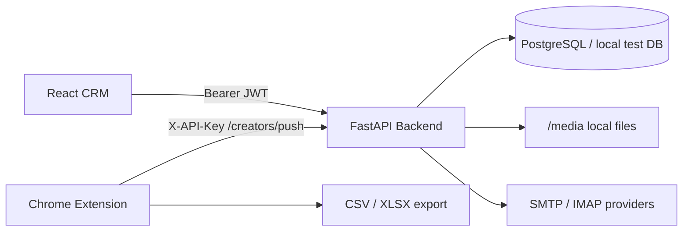
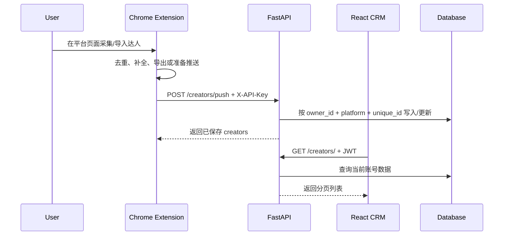
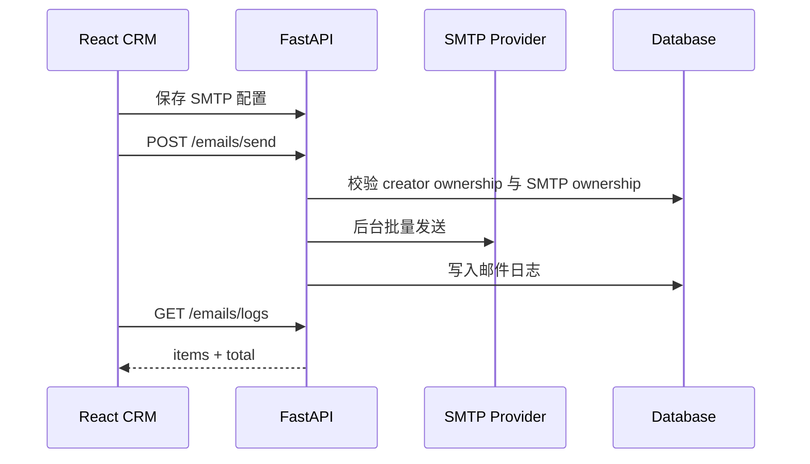

# CreatorScan

CreatorScan 是一个面向海外达人线索采集和邮件触达的全栈 CRM 工具。仓库由三部分组成：Chrome 扩展负责从 TikTok / Instagram / YouTube 采集达人数据，FastAPI 后端负责账号、线索、邮件和统计数据，React CRM 前端负责线索管理、筛选、标签、邮件营销和配置。

## 目录

- [功能概览](#功能概览)
- [系统架构](#系统架构)
- [项目结构](#项目结构)
- [本地快速启动](#本地快速启动)
- [环境变量](#环境变量)
- [后端 API](#后端-api)
- [前端 CRM](#前端-crm)
- [Chrome 扩展](#chrome-扩展)
- [核心数据流](#核心数据流)
- [测试与质量检查](#测试与质量检查)
- [数据库与迁移](#数据库与迁移)
- [常见问题](#常见问题)
- [开发约定](#开发约定)
- [发布与部署建议](#发布与部署建议)

## 功能概览

### 达人采集与补全

- 支持 TikTok / Instagram / YouTube 页面采集和任务化采集。
- 支持在扩展结果页导出 CSV / XLSX。
- 支持将采集结果通过 API Key 推送到后端。
- 支持 TikTok / Instagram 自动补全队列，补全国家/地区、头像、邮箱、外链等信息。
- 支持删除无邮箱数据，便于清理低价值线索。
- 支持扩展侧和后端侧头像缓存，降低远程 CDN 失效对 CRM 展示的影响。

### CRM 线索管理

- 登录后查看仪表盘、达人列表、达人详情、邮件营销、子账号、设置和 API Key 页面。
- 支持按平台、关键词、邮箱状态、ShareLink 状态、粉丝数和国家/地区筛选。
- 支持 Excel / CSV 导入达人。
- 支持单个或批量添加标签。
- 支持手动跟进状态。
- 支持“全选全部匹配结果”，方便批量操作当前筛选集。

### 邮件营销

- 支持 SMTP 配置的新增、编辑、删除和连接测试。
- 支持批量发送邮件。
- 支持邮件发送日志、回复状态、统计和后台同步。
- 支持邮件模板 CRUD。
- 支持多 SMTP 配置发送。

### 账号与安全

- 支持主账号注册、登录和 JWT 鉴权。
- 支持子账号管理。
- 支持 API Key 供扩展推送数据。
- 支持 2FA 设置、启用、禁用和登录 OTP 校验。
- 支持用户审计日志。

## 系统架构



默认本地端口：

- 后端 API: `http://localhost:8090`
- 前端 CRM: `http://localhost:5173`
- API 文档: `http://localhost:8090/docs`

## 项目结构

```text
CreatorScan/
├── creator_scan_api/              # FastAPI 后端
│   ├── app/
│   │   ├── core/                  # 配置、数据库、安全、异常
│   │   └── domains/               # auth/user/creator/email/dashboard 领域模块
│   ├── alembic/                   # 数据库迁移
│   ├── tests/                     # pytest 测试
│   ├── requirements.txt
│   └── README.md
├── leadflow-influencer-crm/        # React + Vite + TypeScript 前端
│   ├── pages/
│   ├── components/
│   ├── services/
│   ├── constants/
│   ├── tests/
│   ├── package.json
│   └── README.md
├── chrome_extension/               # Manifest V3 Chrome 扩展
│   ├── manifest.json
│   ├── popup.html / popup.js
│   ├── results.html / results.js
│   ├── content.js
│   ├── injected.js
│   ├── background.js
│   └── README.md
├── output/                         # 调试/导出产物，默认视为临时文件
├── RUNBOOK.md                      # 本地运行手册
├── DEVELOPMENT_PLAN.md             # 阶段计划与历史完成项
└── .github/workflows/ci.yml        # CI
```

## 本地快速启动

建议按“后端 -> 前端 -> 扩展”的顺序启动。

### 1. 启动后端

```bash
cd creator_scan_api
python3 -m venv .venv
source .venv/bin/activate
pip install -r requirements.txt
cp .env.example .env
uvicorn app.main:app --reload --host 0.0.0.0 --port 8090
```

启动后打开：

- `http://localhost:8090/`
- `http://localhost:8090/docs`

### 2. 启动前端

```bash
cd leadflow-influencer-crm
npm install
cp .env.example .env
npm run dev
```

打开 `http://localhost:5173`。

### 3. 加载 Chrome 扩展

1. 打开 `chrome://extensions`。
2. 开启 Developer mode。
3. 点击 Load unpacked。
4. 选择仓库中的 `chrome_extension/` 目录。
5. 打开扩展结果页，填写：
   - `服务器地址`: `http://localhost:8090`
   - `服务器 API Key`: 在 CRM 的 API 设置页面获取。

### 4. 首次使用流程

1. 在 CRM 注册主账号。
2. 登录 CRM。
3. 进入 API 设置页复制 API Key。
4. 在扩展结果页保存 API Key 和后端地址。
5. 在 TikTok / Instagram / YouTube 页面采集或导入数据。
6. 在扩展中推送数据到服务器。
7. 回到 CRM 的达人列表查看、筛选、打标签和触达。

## 环境变量

根目录 `.env.example` 只提供统一端口和后端地址提示。实际运行时使用各子项目自己的 `.env.example`。

### 后端 `creator_scan_api/.env`

```env
ENV=development
HOST=0.0.0.0
PORT=8090

SECRET_KEY=change_me_in_production
ALGORITHM=HS256
ACCESS_TOKEN_EXPIRE_MINUTES=10080

# 推荐生产环境使用 PostgreSQL
POSTGRES_USER=user
POSTGRES_PASSWORD=password
POSTGRES_SERVER=localhost
POSTGRES_DB=creatorscan
SQLALCHEMY_DATABASE_URL=

CORS_ORIGINS=http://localhost:5173,http://localhost:3000
CORS_ALLOW_CREDENTIALS=true
CORS_ALLOW_ORIGIN_REGEX=chrome-extension://.*
```

说明：

- `SQLALCHEMY_DATABASE_URL` 为空时，后端会根据 `POSTGRES_*` 字段拼接 PostgreSQL 连接串。
- `AUTO_CREATE_TABLES` 默认为 `true`，本地开发方便启动；生产环境建议改为 `false` 并使用 Alembic。
- `CORS_ALLOW_ORIGIN_REGEX=chrome-extension://.*` 用于允许本地安装的 Chrome 扩展访问后端。
- 生产环境必须更换 `SECRET_KEY`，并使用安全的数据库密码和网络访问策略。

### 前端 `leadflow-influencer-crm/.env`

```env
VITE_PORT=5173
VITE_API_BASE_URL=http://localhost:8090
```

`VITE_API_BASE_URL` 需要和后端实际地址一致。前端会将 JWT 存在浏览器 `localStorage`，并自动在 API 请求中添加 `Authorization: Bearer <token>`。

### 扩展配置

扩展没有构建期环境变量，运行时在结果页配置：

- `serverUrl`: 后端地址，例如 `http://localhost:8090`
- `serverApiKey`: CRM 中当前账号的 API Key

配置保存在 `chrome.storage.local`。

## 后端 API

后端位于 `creator_scan_api/`，基于 FastAPI、SQLAlchemy、Pydantic、Alembic。

### 领域模块

- `app/core/`: 配置、数据库连接、安全、异常处理。
- `app/domains/auth/`: 登录、JWT、API Key 鉴权。
- `app/domains/user/`: 用户、主账号/子账号、密码、2FA、审计日志。
- `app/domains/creator/`: 达人导入、推送、查询、删除、状态和标签。
- `app/domains/email/`: SMTP、邮件发送、日志、回复同步、模板。
- `app/domains/dashboard/`: CRM 仪表盘统计。

### 主要接口

| 方法 | 路径 | 鉴权 | 说明 |
| --- | --- | --- | --- |
| `POST` | `/users/register` | 无 | 注册主账号 |
| `POST` | `/token` | 表单用户名密码 | 登录，2FA 账号需要 `otp_code` |
| `GET` | `/users/me` | JWT | 当前用户资料 |
| `PUT` | `/users/me` | JWT | 更新用户名 |
| `PUT` | `/users/me/password` | JWT | 修改密码 |
| `POST` | `/users/me/2fa/setup` | JWT | 生成 2FA secret 和 otpauth URL |
| `POST` | `/users/me/2fa/enable` | JWT | 启用 2FA |
| `POST` | `/users/me/2fa/disable` | JWT | 禁用 2FA |
| `GET` | `/users/sub-accounts` | JWT | 子账号列表 |
| `POST` | `/users/sub` | JWT | 创建子账号 |
| `DELETE` | `/users/sub/{sub_id}` | JWT | 删除子账号 |
| `GET` | `/users/audit-logs` | JWT | 审计日志 |
| `POST` | `/creators/push` | `X-API-Key` | 扩展推送达人 |
| `POST` | `/creators/import` | JWT | Excel / CSV 导入达人 |
| `GET` | `/creators/` | JWT | 分页、搜索和筛选达人 |
| `GET` | `/creators/{creator_id}` | JWT | 达人详情 |
| `PATCH` | `/creators/{creator_id}/status` | JWT | 更新手动跟进状态 |
| `PATCH` | `/creators/{creator_id}/tags` | JWT | 单个达人标签更新 |
| `POST` | `/creators/tags/batch` | JWT | 批量标签更新 |
| `DELETE` | `/creators/{creator_id}` | JWT | 删除达人 |
| `GET` | `/dashboard/stats` | JWT | 仪表盘统计 |
| `GET` | `/emails/smtp` | JWT | SMTP 配置列表 |
| `POST` | `/emails/smtp` | JWT | 新建 SMTP 配置 |
| `POST` | `/emails/smtp/test` | JWT | 测试 SMTP 连接 |
| `POST` | `/emails/send` | JWT | 批量发送邮件 |
| `POST` | `/emails/sync` | JWT | 同步邮件回复 |
| `GET` | `/emails/logs` | JWT | 邮件日志，返回 `{ items, total }` |
| `GET` | `/emails/logs/stats` | JWT | 邮件统计 |
| `GET/POST/PUT/DELETE` | `/templates/*` | JWT | 邮件模板管理 |

### API 示例

注册并登录：

```bash
curl -X POST http://localhost:8090/users/register \
  -H 'Content-Type: application/json' \
  -d '{"username":"demo","password":"demo12345"}'

curl -X POST http://localhost:8090/token \
  -H 'Content-Type: application/x-www-form-urlencoded' \
  -d 'username=demo&password=demo12345'
```

扩展推送达人数据：

```bash
curl -X POST http://localhost:8090/creators/push \
  -H 'Content-Type: application/json' \
  -H 'X-API-Key: <your-api-key>' \
  -d '[
    {
      "platform": "TikTok",
      "unique_id": "creator_handle",
      "data": {
        "nickname": "Creator Name",
        "email": "hello@example.com",
        "followers": "120000",
        "location": "US",
        "tags": ["beauty", "priority"]
      }
    }
  ]'
```

查询达人：

```bash
curl 'http://localhost:8090/creators/?platform=TikTok&has_email=true&limit=20' \
  -H 'Authorization: Bearer <jwt-token>'
```

## 前端 CRM

前端位于 `leadflow-influencer-crm/`，基于 React、Vite、TypeScript、React Router、Axios、Vitest。

### 页面路由

| 路由 | 说明 |
| --- | --- |
| `/login` | 登录、2FA 输入 |
| `/dashboard` | 统计卡片、趋势和最近活动 |
| `/influencers` | 达人列表、筛选、导入、批量选择、批量标签 |
| `/details/:id` | 达人详情、状态、标签、字段展示 |
| `/marketing` | 邮件发送、模板、日志和统计 |
| `/sub-accounts` | 子账号和审计日志 |
| `/settings` | 账号、密码、2FA、SMTP 配置 |
| `/api-keys` | 查看当前账号 API Key |

### 前端 API 层

所有请求集中在 `leadflow-influencer-crm/services/api.ts`：

- `authService`: 登录、注册、当前用户。
- `userService`: 用户资料、密码、子账号、审计、2FA。
- `creatorService`: 达人列表、详情、导入、删除、状态、标签。
- `smtpService`: SMTP 配置 CRUD 和测试。
- `emailService`: 邮件发送、日志、统计、同步。
- `templateService`: 邮件模板 CRUD。

前端会自动处理 `401`：清除本地 token 并跳转到 `/login`。

## Chrome 扩展

扩展位于 `chrome_extension/`，使用 Chrome Manifest V3，无独立构建步骤。

### 关键文件

| 文件 | 说明 |
| --- | --- |
| `manifest.json` | 扩展权限、脚本注册、图标和 host permissions |
| `popup.html` / `popup.js` | 扩展弹窗、任务创建、手动采集入口 |
| `results.html` / `results.js` | 数据看板、导出、推送、配置、自动补全 |
| `content.js` | 注入到目标站点的内容脚本 |
| `injected.js` | 在页面上下文拦截 TikTok / Instagram 请求数据 |
| `background.js` | service worker、任务队列、补全、外链邮箱提取、头像缓存 |
| `xlsx.mini.min.js` | XLSX 导出依赖 |

### 权限说明

扩展请求了：

- `storage`: 保存采集结果、API Key、后端地址。
- `unlimitedStorage`: 支持较大的本地采集结果。
- `tabs` / `activeTab` / `scripting`: 管理采集页、注入脚本、后台补全。
- `host_permissions`: 访问 TikTok、Instagram、YouTube 以及外链补全需要的 HTTP/HTTPS 页面。

### 推送协议

扩展将数据推送到：

```text
POST {serverUrl}/creators/push
Header: X-API-Key: <serverApiKey>
Body: CreatorCreate[]
```

单条数据结构：

```json
{
  "platform": "TikTok",
  "unique_id": "creator_handle",
  "data": {
    "nickname": "Creator Name",
    "email": "hello@example.com",
    "avatar": "https://...",
    "location": "US",
    "shareLinks": ["https://..."],
    "tags": ["tag1", "tag2"]
  }
}
```

## 核心数据流

### 采集到 CRM



### 邮件触达



## 测试与质量检查

### 后端

```bash
cd creator_scan_api
source .venv/bin/activate
python -m compileall app
pytest -q
```

后端测试覆盖：

- 注册、登录、当前用户。
- 达人推送、筛选、删除、状态。
- owner 维度的数据隔离。
- 地区、标签、头像缓存。
- 邮件发送权限校验。
- 密码修改、用户名冲突。
- 2FA 启用和 OTP 登录。
- 邮件日志合同。
- SMTP 和筛选逻辑。

### 前端

```bash
cd leadflow-influencer-crm
npm test
npm run build
```

前端测试覆盖：

- API asset URL 处理。
- 国家/地区选项。
- 自定义 select / multi-select。
- 反馈组件。
- 核心页面 smoke tests。

### CI

GitHub Actions 配置位于 `.github/workflows/ci.yml`：

- 后端：Python 3.11、安装依赖、`compileall`、`pytest -q`。
- 前端：Node 20、`npm install`、`npm test`、`npm run build`。

## 数据库与迁移

后端默认使用 SQLAlchemy。配置优先级：

1. 使用 `SQLALCHEMY_DATABASE_URL`。
2. 如果为空，则由 `POSTGRES_USER`、`POSTGRES_PASSWORD`、`POSTGRES_SERVER`、`POSTGRES_DB` 拼接 PostgreSQL URL。

本地开发可以使用 `AUTO_CREATE_TABLES=true` 自动建表。生产和共享环境建议：

```bash
cd creator_scan_api
alembic upgrade head
```

当前迁移文件位于 `creator_scan_api/alembic/versions/`。

## 常见问题

### 前端登录后立刻跳回登录页

- 确认后端正在运行。
- 确认 `leadflow-influencer-crm/.env` 中 `VITE_API_BASE_URL` 指向正确后端地址。
- 打开浏览器开发者工具，检查 `/users/me` 或其他接口是否返回 `401`。
- 重新登录以刷新本地 token。

### 前端出现 CORS 错误

- 确认 `creator_scan_api/.env` 中 `CORS_ORIGINS` 包含前端地址，例如 `http://localhost:5173`。
- 修改 `.env` 后重启后端。
- 如果是扩展访问后端，确认 `CORS_ALLOW_ORIGIN_REGEX=chrome-extension://.*`。

### 扩展推送失败

- 确认扩展结果页的 `服务器地址` 可以打开 `/docs`。
- 确认 API Key 来自当前登录账号。
- 确认请求 header 中存在 `X-API-Key`。
- 如果后端返回权限错误，重新在 CRM API 设置页复制 API Key。

### 邮件发送失败

- 确认已配置 SMTP。
- 优先使用邮箱服务提供商的应用专用密码/授权码，而不是登录密码。
- 在设置页先执行 SMTP 测试。
- 检查邮件日志中的失败原因。

### 数据库连接失败

- 检查 PostgreSQL 是否运行。
- 检查 `SQLALCHEMY_DATABASE_URL` 或 `POSTGRES_*` 配置。
- 本地快速验证可以先使用测试环境的 SQLite 配置方式，但正式开发建议使用 PostgreSQL。

### 头像不显示

- 确认后端 `/media` 静态目录可访问。
- 确认 `MEDIA_ROOT` 存在且后端进程有写入权限。
- 前端会通过 `VITE_API_BASE_URL` 拼接 `/media/...` 路径。

## 开发约定

### 分支和提交

- 建议使用短小明确的提交信息，例如：
  - `api: fix creator push ownership`
  - `frontend: add influencer tag filter`
  - `extension: improve tiktok hydration queue`
  - `docs: add project readme`

### 代码风格

- Python 使用 4 空格缩进，函数和模块使用 `snake_case`，模型和 schema 使用 `PascalCase`。
- React 组件和页面使用 `PascalCase` 文件名。
- TypeScript helper/service 使用 `camelCase`。
- 变更应尽量聚焦，不做无关重构。

### 临时文件

以下内容通常不应提交：

- `.env`
- `.DS_Store`
- `__pycache__/`
- 本地数据库文件，例如 `*.db`
- HAR 抓包文件
- Playwright/调试输出
- `output/` 中非 fixture 的临时产物

## 发布与部署建议

### 后端

- 使用 PostgreSQL。
- 设置强随机 `SECRET_KEY`。
- 设置 `AUTO_CREATE_TABLES=false`。
- 使用 `alembic upgrade head` 管理 schema。
- 限制生产 CORS，仅允许实际前端域名和必要扩展来源。
- 将 `/media` 目录挂载到持久化存储。
- 使用 HTTPS。

### 前端

- 构建前设置生产后端地址：

```bash
cd leadflow-influencer-crm
npm install
VITE_API_BASE_URL=https://api.example.com npm run build
```

- 部署 `dist/` 到静态托管服务。
- 确认生产后端 CORS 允许前端域名。

### Chrome 扩展

- 发布前检查 `manifest.json` 的权限范围。
- 如果生产后端域名固定，可在说明中引导用户填写生产 `serverUrl`。
- 发布前用真实账号验证：
  - 采集
  - 自动补全
  - 导出
  - API Key 推送
  - CRM 展示

## 相关文档

- [后端 README](creator_scan_api/README.md)
- [前端 README](leadflow-influencer-crm/README.md)
- [扩展 README](chrome_extension/README.md)
- [本地运行手册](RUNBOOK.md)
- [开发计划](DEVELOPMENT_PLAN.md)
